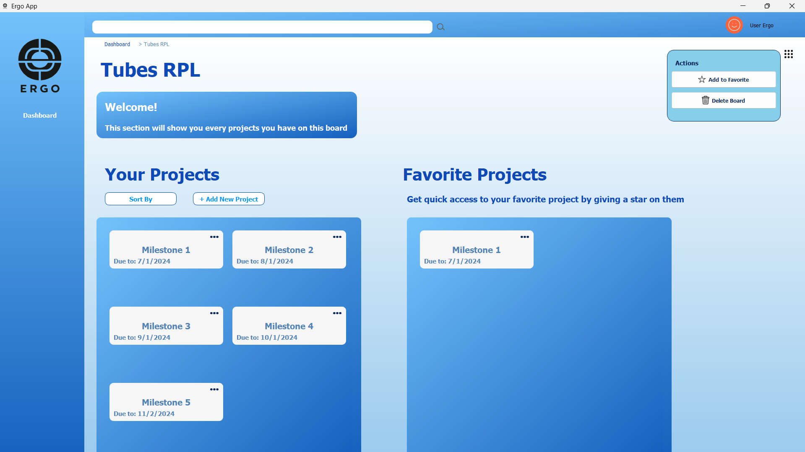

# Ergo Project Tracker Management Application

## Deskripsi Aplikasi
Memiliki banyak pekerjaan atau tugas yang banyak sudah menjadi hal yang biasa bagi mahasiswa atau pekerja. Tidak jarang juga mereka kewalahan dalam me-manage pekerjaan tersebut. Maka dibuatlah Ergo. Ergo adalah sebuah sistem yang dirancang untuk mempermudah individu yang memiliki banyak tugas dengan menyediakan alat untuk melacak, mengelola, dan memantau perkembangan setiap tugas yang mereka miliki. Sistem ini memungkinkan pengguna untuk mengatur tugas-tugas mereka secara efisien dan efektif, serta memberikan visibilitas yang lebih baik terhadap progres dan status setiap tugas.

Ergo adalah sebuah perangkat lunak yang dirancang untuk membantu pengguna dalam mengelola daftar tugas atau task untuk berbagai proyek yang mereka kerjakan. Dengan Ergo, pengguna dapat dengan mudah membuat, mengatur, dan melacak progres tugas-tugas yang perlu diselesaikan. Aplikasi ini memberikan pengguna kemampuan untuk menetapkan tenggat waktu, menambahkan catatan, serta memprioritaskan tugas-tugas berdasarkan urgensi atau pentingnya. Dengan demikian, Ergo menjadi alat yang sangat berguna bagi tiap individu dalam mengelola waktu dan proyek dengan lebih efisien.

## Cara Menjalankan Aplikasi
Aplikasi dapat dijalankan dengan melakukan langkah - langkah berikut ini : 
1. Clone repository ini 
```sh
git clone https://gitlab.informatika.org/Christian_Justin/if2250-2024-k03-g04-ergo.git
```
2. Masuk ke dalam folder hasil clone

```sh
cd if2250-2024-k03-g04-ergo
```

3. Download package yang dibutuhkan
```sh
pip install -r requirements.txt
```

4. Program sudah bisa dijalankan dengan command 
```sh
python main.py
```


## Modul dan Pembagian Tugas
- Modul mengolah Board (Melihat, Menambah, Menghapus, dan Mengubah)
<br>
<br>
<br>

- Modul mengolah Project (Melihat, Menambah, Menghapus, Mengubah, dan Sorting)
<br>
<br>
<br>
<br>

- Modul mengolah Task (Melihat, Menambah, Menghapus, Mengubah, Grouping dan Sorting)
<br>
<br>
<br>
<br>
<br>

Pembagian Tugas
| NIM | Nama | Tugas |
|-------|--------|-------|
| 13522135 | Christian Justin Hendrawan | Database, Database manager, Design UI for all page |
| 13522142 | Farhan Raditya Aji | Dasboard / Home page, Controller Dashboard|
| 13522146 | M. Zaidan Sa’dun Robbani | Board page, Controller Board Page |
| 13522155 | Axel Santadi Warih| Task Page, Controller Task Page |
| 13522159 | Rafif Ardhinto Ichwantoro | Integrating Between Scene|

## Daftar Tabel Basis Data
Tabel Boards<br>
Atribut-atribut pada Tabel Boards adalah sebagai berikut:
- idBoard dengan tipe data integer
- namaBoard dengan tipe data string
- isFavorite dengan tipe data integer

Tabel Projects <br>
Atribut-atribut pada Tabel Projects adalah sebagai berikut:
- idProject dengan tipe data integer
- idBoard dengan tipe data integer
- namaProject dengan tipe data string
- tingkatKetuntasan dengan tipe data integer
- deadlineProject dengan tipe data string
- isFavorite dengan tipe data integer

Tabel Tasks<br>
Atribut-atribut pada Tabel Tasks adalah sebagai berikut:
- idTask dengan tipe data integer
- idProject dengan tipe data integer
- namaTask dengan tipe data string
- status dengan tipe data string
- kategori dengan tipe data string
- deskripsi dengan tipe data string
- deadlineTask dengan tipe data string
